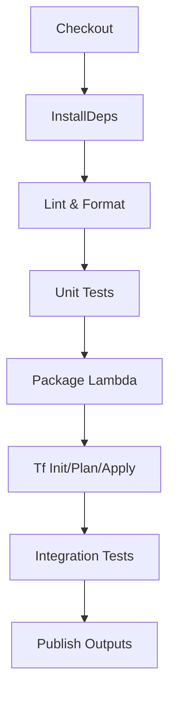
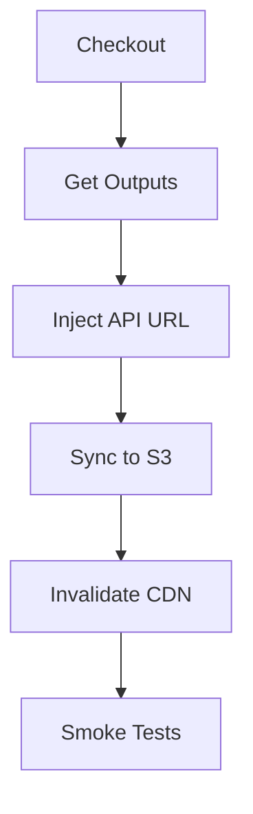
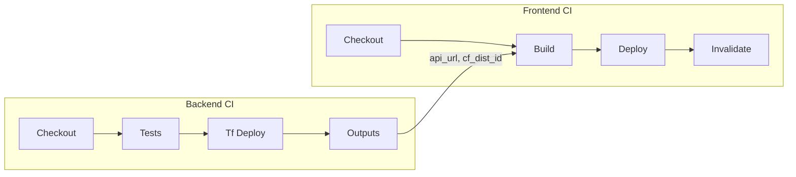
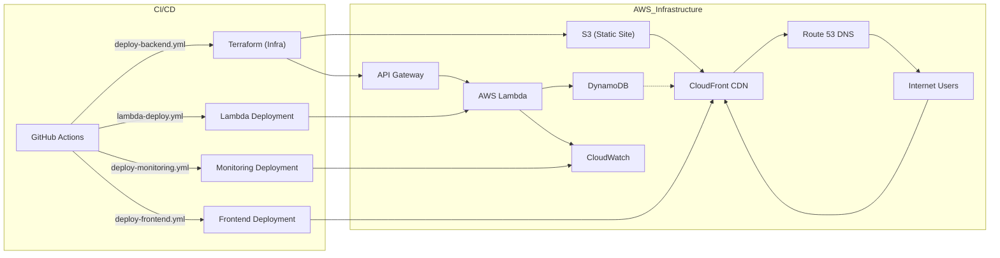

# HybridMulti Cloud Resume API

**Live Site:** [https://hybridmulti.cloud](https://hybridmulti.cloud)

---

## 🎯 Resume API Unified Overview
This document provides a consolidated view of the full-stack Resume API solution, covering both the **resume-api-backend** and **resume-api-frontend** repositories, their CI/CD workflows, cross-repo dependencies, and end-to-end architecture.

---

## 📂 Repository Structure & Responsibilities
| Repository               | Purpose                                 | Key Technologies                                   |
|--------------------------|-----------------------------------------|----------------------------------------------------|
| **resume-api-backend**   | REST API for resume data                | Python, AWS Lambda, API Gateway, DynamoDB, Terraform |
| **resume-api-frontend**  | Static website UI for the API           | HTML, CSS, JavaScript, S3, CloudFront, GitHub Actions |

---

## 1. Backend Workflow (`resume-api-backend`)

### 1.1 Folder Layout
```
resume-api-backend/
├── .github/                # CI/CD configs
├── infra/                  # Terraform code for backend services
├── monitoring/             # Terraform for monitoring (CloudWatch, Synthetics)
├── src/                    # Application source code
│   └── update_visitor_count.py  # Lambda handler logic
└── README.md               # This file
```

### 1.2 Pipeline Triggers
- **push** to `main`
- **pull_request** targeting `main`

### 1.3 CI/CD Steps
1. Checkout source code
2. Setup Python environment and install dependencies
3. Lint & format with Black and Flake8
4. Run unit tests (pytest + moto)
5. Package Lambda into `lambda_function.zip`
6. Terraform tasks:
   - `terraform init`, `validate`, `plan`
   - `terraform apply` (outputs: `api_gateway_url`, `lambda_arn`, `dynamodb_table_name`)
7. Execute integration tests against deployed API
8. Publish outputs (`api_url`, `cf_dist_id`) as GitHub Actions outputs



### 1.4 Components
- **Terraform** defines:
  - **DynamoDB**: `aws_dynamodb_table.VisitorCount` with `visits` attribute (number) and on-demand billing
  - **API Gateway v2**: `aws_apigatewayv2_api` HTTP API named `UpdateVisitorCount`
  - **Integration**: `aws_apigatewayv2_integration` linking API to Lambda function
  - **Route**: `aws_apigatewayv2_route` for `POST /UpdateVisitorCount`
  - **Lambda**: `aws_lambda_function.visitor_counter` with handler `update_visitor_count.lambda_handler`
  - **Permission**: `aws_lambda_permission.apigw` allowing API Gateway to invoke Lambda
  - **IAM Role**: `aws_iam_role.lambda_exec` and `aws_iam_role.apigw_exec` with least-privilege policies
- **Lambda** (`src/update_visitor_count.py`):
  - Reads current `visits` from DynamoDB, increments, writes back
  - Returns JSON `{ "visits": <new_count> }`

### 1.5 GitHub Actions Workflows (Backend)
| Workflow File             | Purpose & Steps                                                                                 |
|---------------------------|-------------------------------------------------------------------------------------------------|
| `deploy-backend.yml`      | Runs Terraform `init`, `plan`, and `apply` in `infra/` to provision/update backend resources     |
| `lambda-deploy.yml`       | Packages `src/update_visitor_count.py` and updates the Lambda via AWS CLI                        |
| `deploy-monitoring.yml`   | Applies Terraform in `monitoring/` to create/update CloudWatch alarms and Synthetics canaries   |

---

## 2. Frontend Workflow (`resume-api-frontend`)

### 2.1 Folder Layout
```
resume-api-frontend/
├── public/                          # Generated static site
│   ├── index.html                   # Final HTML
│   └── assets/                      # CSS, JS, images
├── index.tmpl.html                  # HTML template with ${API_URL}
├── style.css                        # Stylesheet
└── terraform/                       # Infra code for S3, CloudFront, Route53
    ├── frontend_infra.tf            # Main Terraform config (bucket, CDN, DNS)
    ├── variables.tf                 # Variables: bucket_name, domain_name, cert_arn, price_class
    ├── outputs.tf                   # Outputs: bucket_name, cf_dist_id, cf_domain_name, oai_id
    └── versions.tf                  # Terraform required providers and versions
```

### 2.2 Pipeline Triggers
- **push** to `main`
- **pull_request** targeting `main`

### 2.3 CI/CD Steps
1. Checkout source code
2. Download infra outputs (`api_url`, `cf_dist_id`)
3. Inject `${API_URL}` into `index.tmpl.html` → `public/index.html`
4. Sync `public/` to S3 (`aws s3 sync`)
5. Invalidate CloudFront (`aws cloudfront create-invalidation`)
6. Smoke tests: GET homepage returns HTTP 200 and correct visitor count



### 2.4 Components
- **Template Injection**: fills `public/index.html` with live API endpoint
- **Static Hosting**: S3 bucket (website), CloudFront CDN for HTTPS
- **GitHub Actions**:
  - `deploy-frontend.yml`: Build, upload, invalidate cache

### 2.5 Frontend Terraform Components
- **Origin Access Identity**: `aws_cloudfront_origin_access_identity.oai`
- **S3 Bucket**: `aws_s3_bucket.resume_site` (versioned, SSE-S3, website hosting)
- **Bucket Policy**: allows CloudFront OAI GetObject
- **Logging Bucket**: for CloudFront access logs
- **CloudFront Distribution**: origins, behaviors, error responses, logging, price class, ACM cert
- **Route53 Record**: alias for apex and `www` to CloudFront distribution
- **Variables & Outputs**: `bucket_name`, `domain_name`, `certificate_arn`, `price_class`, `cf_distribution_id`

---

## 3. Cross-Repo Orchestration

| Backend Output       | Storage Location                   | Frontend Input                           |
|----------------------|------------------------------------|------------------------------------------|
| `api_gateway_url`    | GitHub Actions outputs             | Inject into frontend template           |
| `cf_dist_id`         | GitHub Actions outputs             | CloudFront invalidation step            |



---

## 📈 Full Architecture (Mermaid)



---

## 🚀 Getting Started

```bash
git clone https://github.com/hybridmulticloud/cloud-challenge.git
cd cloud-challenge
terraform init -backend...
terraform apply -chdir=resume-api-backend/terraform
terraform apply -chdir=resume-api-frontend/terraform
```

---

## 📄 License

MIT License. See [LICENSE](LICENSE).
