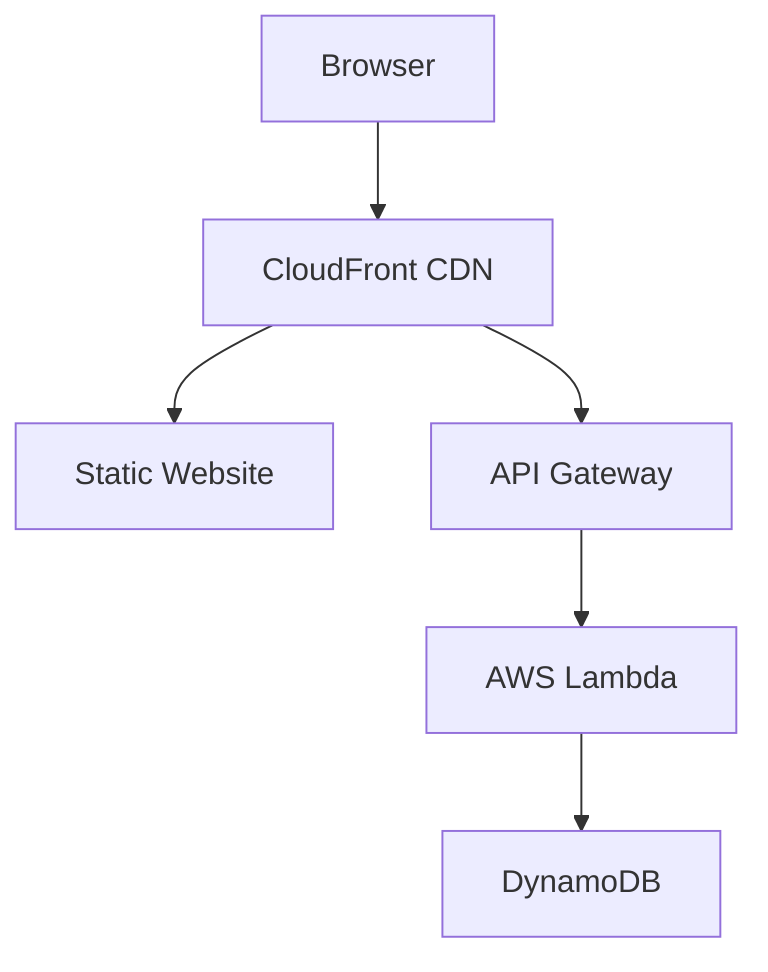
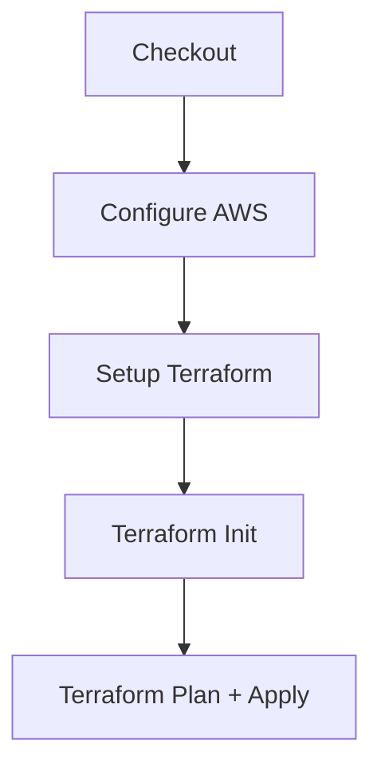
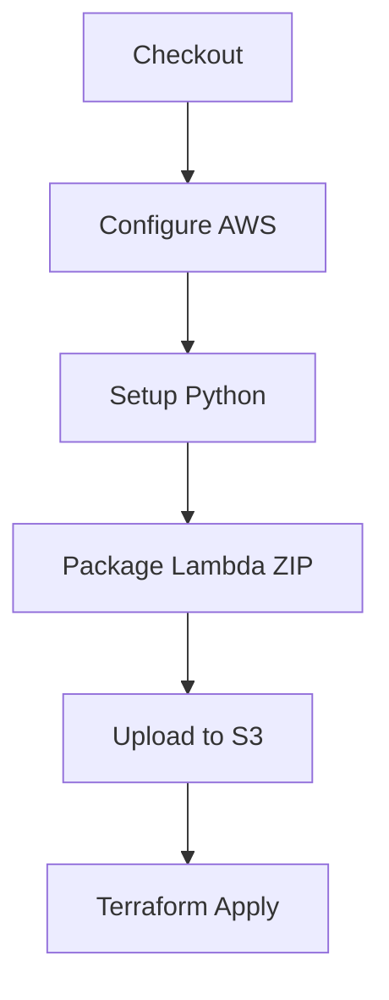
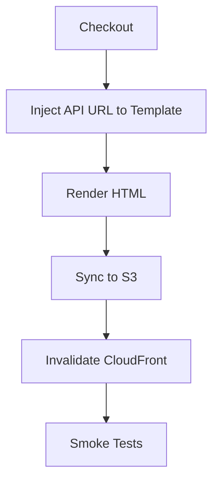
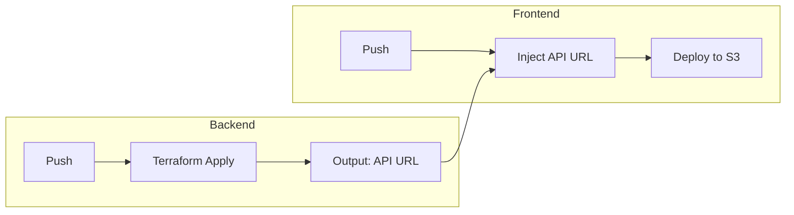
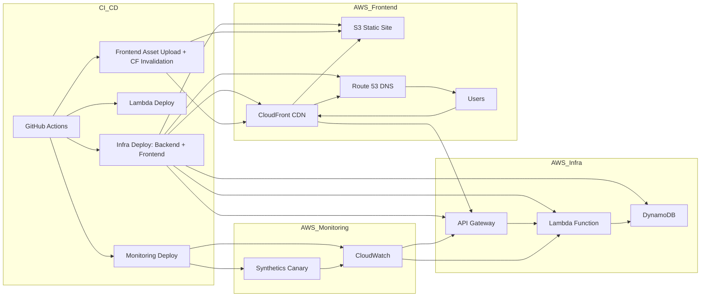

# 🌐 HybridMulti.Cloud - Resume API Project

**Live Site:** [https://hybridmulti.cloud](https://hybridmulti.cloud)

---

## 🎯 Project Overview

This project is a full-stack cloud-native resume viewer that exposes a serverless REST API to track profile views and hosts a static website frontend. It's built with AWS and managed using Infrastructure as Code (Terraform).

## 📘 Inspired by the Cloud Resume Challenge

This project aligns with the official Cloud Resume Challenge steps:

1. Static resume delivered via S3 + CloudFront + custom DNS  
2. Visitor counter implemented using API Gateway, Lambda, and DynamoDB  
3. Infrastructure fully modeled with Terraform  
4. CI/CD via GitHub Actions across frontend, backend, and monitoring  
5. Observability with CloudWatch alarms and canary testing

It’s built to go further than the challenge—automated, monitored, and enterprise-ready.
---

## 🧠 Key Technologies

| Component      | Stack                                                                 |
|----------------|-----------------------------------------------------------------------|
| Backend        | Python, AWS Lambda, API Gateway, DynamoDB, Terraform, GitHub Actions |
| Frontend       | HTML, CSS, JavaScript, AWS S3, CloudFront, GitHub Actions            |
| Infrastructure | Terraform, AWS IAM, S3, API Gateway, Lambda, DynamoDB                |
| Monitoring     | CloudWatch, GitHub Actions                                            |

---

## 📁 Repository Structure

### `resume-api-backend`
<pre><code>
resume-api-backend-main/
├── .github/
│   └── workflows/
│       ├── deploy-backend.yml
│       ├── deploy-monitoring.yml
│       └── lambda-deploy.yml
├── infra/
│   ├── data-sources.tf
│   ├── frontend_infra.tf
│   ├── lambda.tf
│   ├── main.tf
│   ├── outputs.tf
│   ├── providers.tf
│   ├── terraform.tf
│   └── variables.tf
├── monitoring/
│   ├── canaries.tf
│   ├── data-sources.tf
│   ├── iam.tf
│   ├── locals.tf
│   ├── monitoring.tf
│   ├── outputs.tf
│   ├── providers.tf
│   ├── s3.tf
│   ├── terraform.tf
│   └── variables.tf
├── src/
│   └── lambda_function.py
└── README.md
</code></pre>

### `resume-api-frontend`
<pre><code>
resume-api-frontend-main/
├── .github/
│   └── workflows/
│       └── deploy-frontend.yml
├── public/
│   ├── index.tmpl.html
│   └── style.css
└── README.md
</code></pre>
---

## 🚀 How to Deploy

```bash
# Backend
cd resume-api-backend/infra
terraform init && terraform apply

# Frontend (manual)
cd resume-api-frontend/public
aws s3 sync . s3://<bucket-name> --delete
```

---

## 🔐 Environment Variables

These must be set locally or inside GitHub Actions secrets:

- `AWS_ACCESS_KEY_ID`
- `AWS_SECRET_ACCESS_KEY`
- `AWS_REGION`
- `AWS_DEFAULT_REGION` *(optional fallback)*
- `AWS_ACCOUNT_ID`
- `MONITORING_AWS_ACCESS_KEY_ID`
- `MONITORING_AWS_SECRET_ACCESS_KEY`
- `TF_API_TOKEN` *(for Terraform Cloud CLI or backend access)*
- `API_URL` *(used to inject into frontend index page during deploy)*
- `ALERT_EMAIL_ADDRESS`
- `ROUTE53_ZONE_ID`
  
---

## 🧪 CI/CD Summary

- Backend deploys via Terraform + Lambda ZIP upload
- Frontend pushes to S3 with CDN invalidation
- Cross-repo: API URL output → injected into frontend template

---


## 🗺️ High-Level Architecture



---

## 🔁 Backend Infra CI/CD Workflow



---

## 🔁 Lambda CI/CD Workflow



---

## 🔁 Frontend CI/CD Workflow



---

## 🔄 Cross-Repository CI/CD



---

## 🧱 Full Infrastructure Map



---

## 🙋‍♂️ Author & Contribution

This project was fully designed and implemented by Kerem Kirci, a Senior Technical Consultant focused on hybrid/multi-cloud automation. It showcases:

- Serverless API design with AWS Lambda
- Full Infrastructure as Code with Terraform
- CI/CD pipelines with GitHub Actions
- Frontend templating and static site delivery via CloudFront

[LinkedIn](https://linkedin.com/in/kerem-kirci) | [GitHub](https://github.com/hybridmulticloud)

---
